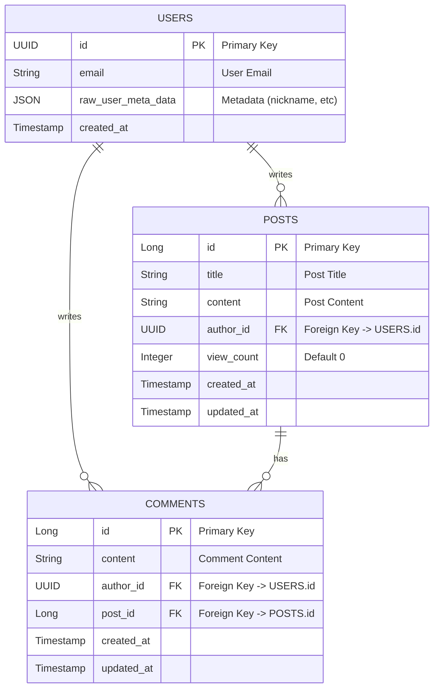

# Entity Relationship Diagram (ERD)

## 데이터베이스 스키마 구조

### 설명
- **USERS**: Supabase Auth의 `auth.users` 테이블입니다. 사용자의 기본 정보와 메타데이터(닉네임 등)를 저장합니다.
- **POSTS**: 게시판의 게시글 정보를 저장합니다. `author_id`를 통해 작성자와 연결됩니다.
- **COMMENTS**: 게시글에 달린 댓글 정보를 저장합니다. `post_id`로 게시글과, `author_id`로 작성자와 연결됩니다.
