# Page Tree

## 프로젝트 페이지 및 컴포넌트 구조

```mermaid
graph TD
    %% Root & Layout
    Root["/ (Root)"] --> App["App.tsx"]
    App --> AuthInit["AuthInitializer (Auto Login)"]
    App --> Navbar["Navbar"]
    App --> Toast["ToastContainer"]
    App --> Animation["Ssgoi (Page Transition)"]

    %% Routes
    Animation --> LandingPage["Landing Page"]
    Animation --> Auth["Auth Routes"]
    Animation --> Board["Board Routes"]
    Animation --> Profile["Profile Routes"]
    Animation --> Analysis["Analysis Routes"]

    %% Auth Pages
    Auth --> Login["/login (LoginPage)"]
    Login --> LoginForm["LoginForm"]

    Auth --> Signup["/signup (SignupPage)"]
    Signup --> SignupForm["SignupForm"]

    %% Board Pages
    Board --> BoardList["/board (BoardPage)"]
    BoardList --> BoardHeader["Header & Write Button"]
    BoardList --> PostList["Post List (Card UI)"]
    PostList --> PostItem["Post Item"]
    BoardList --> Pagination["Pagination"]
    BoardList --> LockScreen["LockScreen (Unauth UI)"]

    Board --> PostDetail["/board/:postId (PostDetailPage)"]
    PostDetail --> DetailHeader["Post Header (Meta Info)"]
    PostDetail --> PostContent["Post Content"]
    PostDetail --> ActionButtons["Edit/Delete Buttons"]
    PostDetail --> CommentSection["Comment Section"]
    CommentSection --> CommentList["Comment List"]
    CommentList --> CommentItem["Comment Item"]
    CommentSection --> CommentForm["Comment Form"]

    Board --> PostCreate["/board/new (PostEditorPage)"]
    PostCreate --> EditorForm["Editor Form"]

    Board --> PostEdit["/board/edit/:postId (PostEditorPage)"]

    %% Profile Pages
    Profile --> MyProfile["/profile (ProfilePage)"]
    MyProfile --> UserInfo["User Info Card"]
    UserInfo --> Avatar["Avatar & Nickname"]
    MyProfile --> ActivityList["My Posts/Comments Tab"]
    ActivityList --> MyPostItem["My Post Item"]

    %% Analysis Pages
    Analysis --> Analyze["/grades/analyze (ImageAnalysisPage)"]
    Analyze --> StepInd["Step Indicator"]
    Analyze --> Upload["Step 1: UploadSection"]
    Upload --> DropZone["Drag & Drop Zone"]
    Analyze --> Verify["Step 2: VerificationSection"]
    Verify --> GradeTable["Editable Grade Table"]

    Analysis --> Result["/grades/result (ImageResultPage)"]
    Result --> ResultHeader["Result Header"]
    Result --> GradeChart["Grade Charts (Recharts)"]
    GradeChart --> GPAChart["GPA Trend Chart"]
    GradeChart --> CreditChart["Credit Distribution Chart"]
    Result --> Summary["Grade Summary"]

    %% Styling
    classDef default fill:#f9f9f9,stroke:#333,stroke-width:1px;
    classDef component fill:#e3f2fd,stroke:#1565c0,stroke-width:1px,stroke-dasharray: 5 5;
    classDef protected fill:#fff3e0,stroke:#ef6c00,stroke-width:2px;

    class AuthInit,Navbar,Toast,Animation,LoginForm,SignupForm,BoardHeader,PostList,PostItem,Pagination,LockScreen,DetailHeader,PostContent,ActionButtons,CommentSection,CommentList,CommentItem,CommentForm,EditorForm,UserInfo,Avatar,ActivityList,MyPostItem,StepInd,Upload,DropZone,Verify,GradeTable,ResultHeader,GradeChart,GPAChart,CreditChart,Summary component;

    %% Protected Pages (Orange)
    class BoardList,PostDetail,PostCreate,PostEdit,MyProfile protected;
```

### 설명

- **Root**: 애플리케이션의 진입점 (`main.tsx` -> `App.tsx`).
- **Components (점선)**: 각 페이지를 구성하는 주요 하위 컴포넌트들입니다.
- **Protected (주황색 테두리)**: 로그인이 필요한 페이지입니다. `ProtectedRoute`로 감싸져 있거나, 페이지 내부에서 비로그인 시 접근 제한 UI(`LockScreen`)를 표시합니다.
