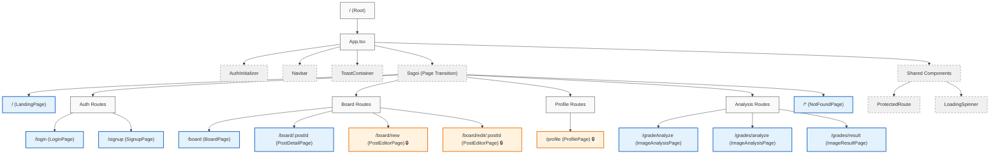

# Page Tree

## 프로젝트 페이지 및 컴포넌트 구조

```mermaid
graph TD
    %% Root & Layout
    Root["/ (Root)"] --> App["App.tsx"]
    App --> AuthInit["AuthInitializer"]
    App --> Navbar["Navbar"]
    App --> Toast["ToastContainer"]
    App --> Animation["Ssgoi (Page Transition)"]

    %% Routes
    Animation --> LandingPage["/ (LandingPage)"]
    Animation --> Auth["Auth Routes"]
    Animation --> Board["Board Routes"]
    Animation --> Profile["Profile Routes"]
    Animation --> Analysis["Analysis Routes"]
    Animation --> NotFound["/* (NotFoundPage)"]

    %% Auth Pages
    Auth --> Login["/login (LoginPage)"]
    Auth --> Signup["/signup (SignupPage)"]

    %% Board Pages
    Board --> BoardList["/board (BoardPage)"]
    Board --> PostDetail["/board/:postId (PostDetailPage)"]
    Board --> PostCreate["/board/new (PostEditorPage) 🔒"]
    Board --> PostEdit["/board/edit/:postId (PostEditorPage) 🔒"]

    %% Profile Pages
    Profile --> MyProfile["/profile (ProfilePage) 🔒"]

    %% Analysis Pages
    Analysis --> GradeAnalyze["/gradeAnalyze (ImageAnalysisPage)"]
    Analysis --> Analyze["/grades/analyze (ImageAnalysisPage)"]
    Analysis --> Result["/grades/result (ImageResultPage)"]

    %% Shared Components
    App --> SharedComponents["Shared Components"]
    SharedComponents --> ProtectedRoute["ProtectedRoute"]
    SharedComponents --> LoadingSpinner["LoadingSpinner"]

    %% Styling
    classDef default fill:#f9f9f9,stroke:#333,stroke-width:1px;
    classDef page fill:#e3f2fd,stroke:#1565c0,stroke-width:2px;
    classDef protected fill:#fff3e0,stroke:#ef6c00,stroke-width:2px;
    classDef component fill:#f0f0f0,stroke:#666,stroke-width:1px,stroke-dasharray: 5 5;

    %% Pages
    class LandingPage,Login,Signup,BoardList,PostDetail,PostCreate,PostEdit,MyProfile,GradeAnalyze,Analyze,Result,NotFound page;

    %% Protected Pages (with ProtectedRoute wrapper)
    class PostCreate,PostEdit,MyProfile protected;

    %% Shared Components
    class AuthInit,Navbar,Toast,Animation,ProtectedRoute,LoadingSpinner,SharedComponents component;
```

### 설명

#### 전체 구조
- **Root**: 애플리케이션의 진입점 (`main.tsx` -> `App.tsx`)
- **App.tsx**: 전역 레이아웃 및 라우팅 설정
  - `AuthInitializer`: 자동 로그인 처리
  - `Navbar`: 네비게이션 바
  - `ToastContainer`: 알림 메시지 표시
  - `Ssgoi`: 페이지 전환 애니메이션

#### 페이지 분류
- **파란색 테두리**: 일반 페이지
- **주황색 테두리 + 🔒**: `ProtectedRoute`로 감싸진 인증 필요 페이지
  - `/board/new`: 게시글 작성
  - `/board/edit/:postId`: 게시글 수정
  - `/profile`: 프로필 페이지

#### 특별 동작
- **BoardPage, PostDetailPage**: ProtectedRoute로 감싸져 있지 않지만, 비로그인 시 페이지 내부에서 접근 제한 UI를 표시합니다.

#### 라우트 목록
**Auth Routes**
- `/login`: 로그인 페이지
- `/signup`: 회원가입 페이지

**Board Routes**
- `/board`: 게시판 목록
- `/board/:postId`: 게시글 상세
- `/board/new`: 게시글 작성 (인증 필요)
- `/board/edit/:postId`: 게시글 수정 (인증 필요)

**Profile Routes**
- `/profile`: 프로필 페이지 (인증 필요)

**Analysis Routes**
- `/gradeAnalyze`: 성적 분석 페이지 (구 라우트)
- `/grades/analyze`: 성적 분석 페이지 (신규 라우트)
- `/grades/result`: 분석 결과 페이지

**Shared Components**
- `ProtectedRoute`: 인증이 필요한 페이지를 감싸는 컴포넌트
- `LoadingSpinner`: 로딩 표시 컴포넌트
