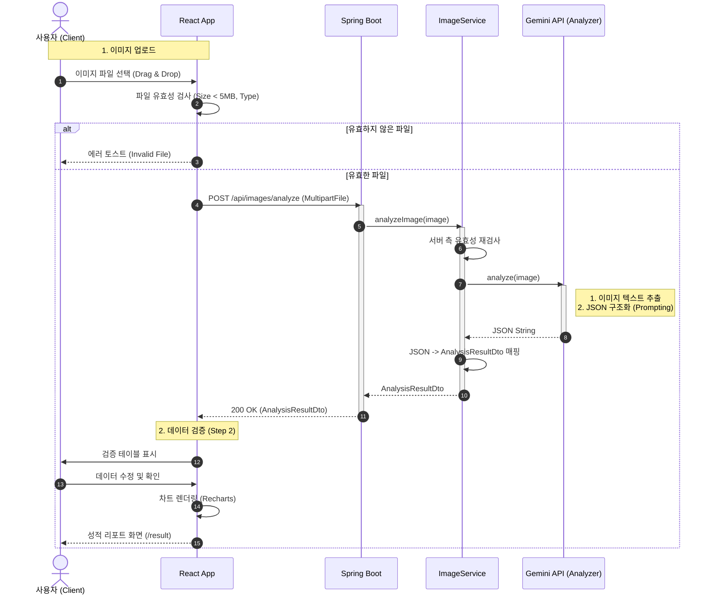
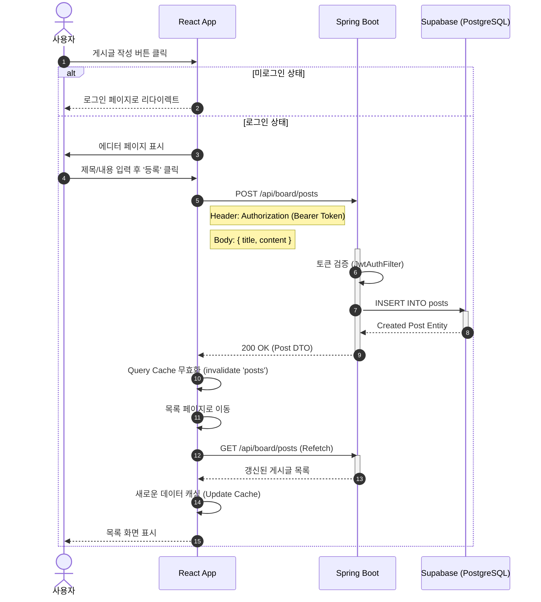
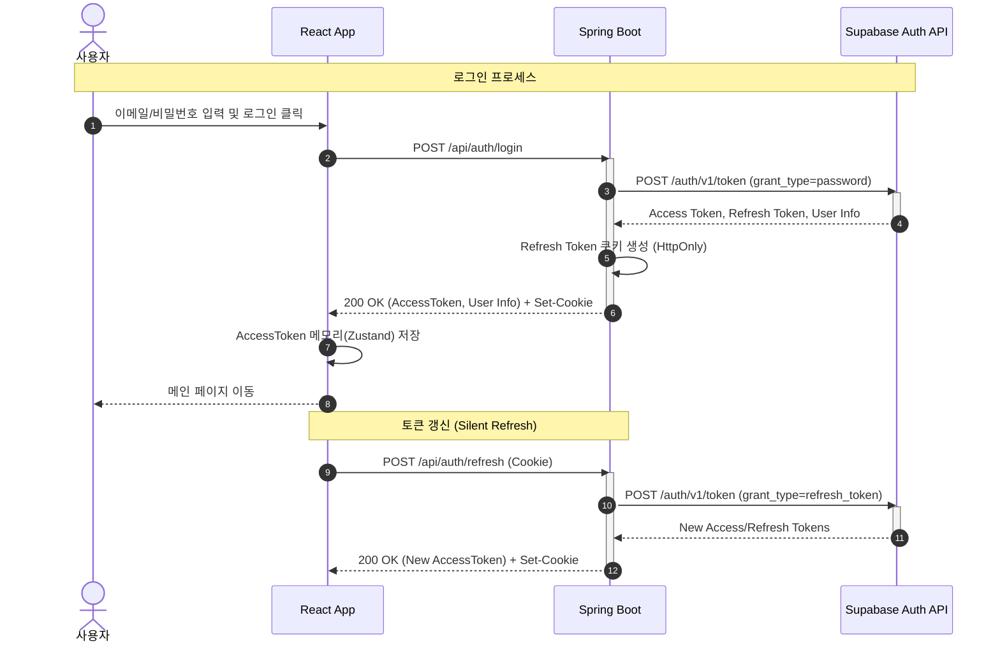
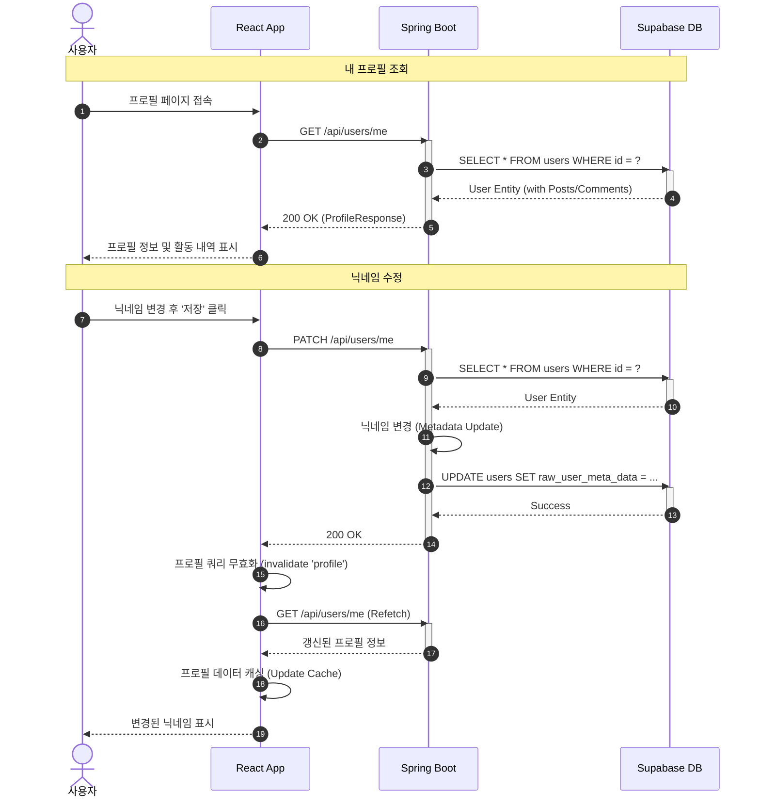
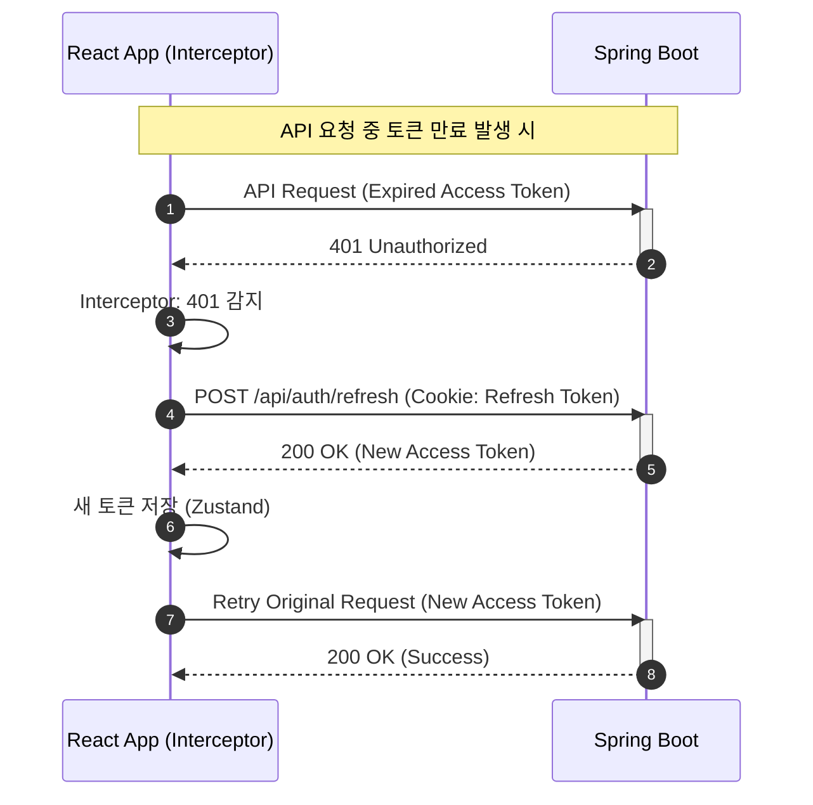
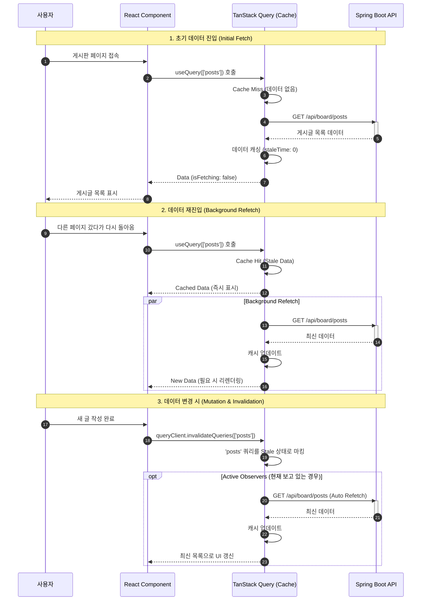

# Sequence Diagram

## 1. 성적표 이미지 분석 흐름 (Image Analysis Flow)

## 2. 게시글 작성 흐름 (Post Creation Flow)

## 3. 인증 흐름 (Authentication Flow)

## 4. 프로필 관리 흐름 (Profile Management Flow)

## 5. 토큰 만료 및 갱신 흐름 (Token Expiration & Retry Flow)

## 6. 데이터 캐싱 및 동기화 흐름 (Data Caching & Synchronization Flow)

