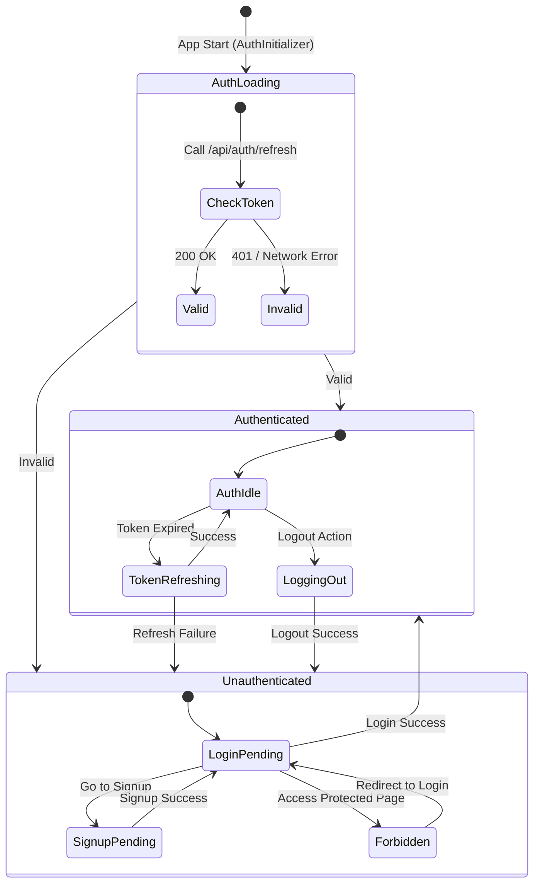
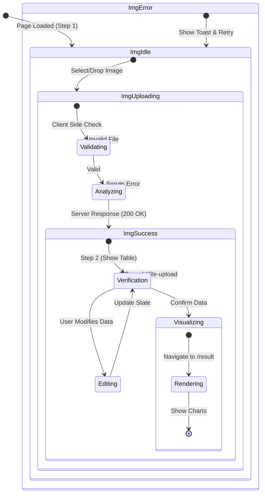
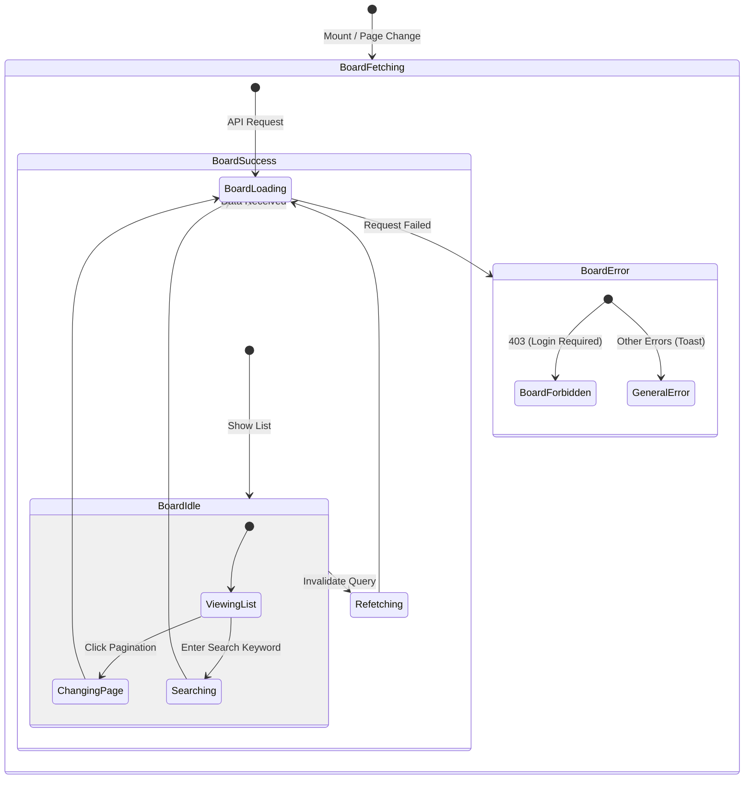
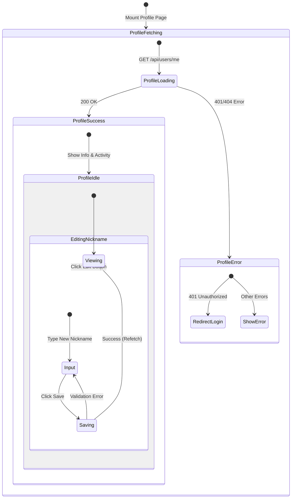

# State Diagram

## 클라이언트 상태 관리 (Client State Management)

### 1. 인증 상태 (Auth State - Zustand)

### 2. 이미지 분석 상태 (Image Analysis State)

### 3. 게시판 데이터 상태 (Board Data - React Query)

### 4. 프로필 데이터 상태 (Profile Data State)

