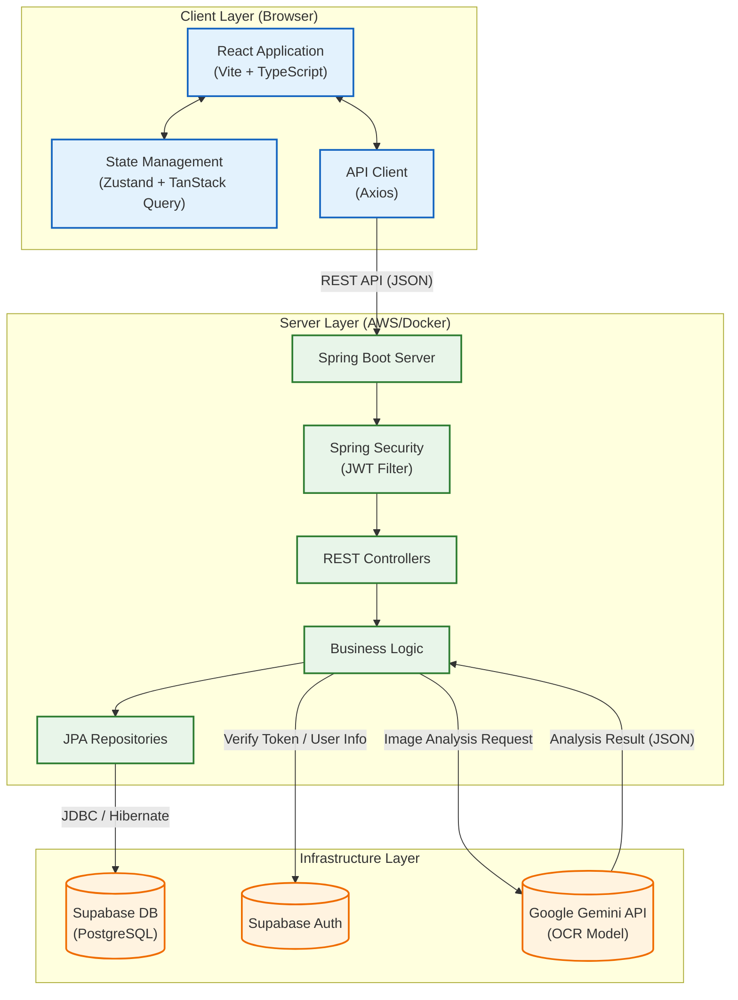

# System Architecture

## 전체 시스템 아키텍처

### 기술 스택 및 역할
1.  **Client (Frontend)**
    *   **React + Vite**: 빠른 개발 및 빌드 환경 제공.
    *   **Zustand**: 전역 상태(인증) 관리.
    *   **TanStack Query**: 서버 상태(게시글, 댓글) 캐싱 및 동기화.

2.  **Server (Backend)**
    *   **Spring Boot**: 안정적인 REST API 서버 구축.
    *   **Spring Security**: JWT 기반의 인증/인가 처리.
    *   **JPA (Hibernate)**: 객체 지향적인 데이터베이스 접근.

3.  **Infrastructure**
    *   **Supabase**: PostgreSQL 데이터베이스 및 인증 서비스 제공.
    *   **Gemini API**: 성적표 이미지의 텍스트 추출 및 구조화(OCR) 담당.
